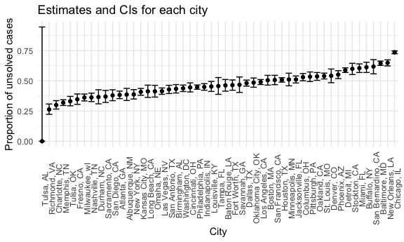
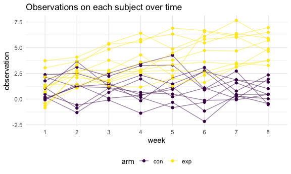

p8105_hw5_az2587
================
Anyu Zhu
11/13/2021

``` r
library(tidyverse)
```

    ## ── Attaching packages ─────────────────────────────────────── tidyverse 1.3.1 ──

    ## ✓ ggplot2 3.3.5     ✓ purrr   0.3.4
    ## ✓ tibble  3.1.5     ✓ dplyr   1.0.7
    ## ✓ tidyr   1.1.4     ✓ stringr 1.4.0
    ## ✓ readr   2.0.2     ✓ forcats 0.5.1

    ## ── Conflicts ────────────────────────────────────────── tidyverse_conflicts() ──
    ## x dplyr::filter() masks stats::filter()
    ## x dplyr::lag()    masks stats::lag()

``` r
library(ggplot2)

knitr::opts_chunk$set(
  fig.width = 6,
  fig.asp = .6,
  out.width = "90%"
)

theme_set(theme_minimal() + theme(legend.position = "bottom"))

options(
  ggplot2.continuous.colour = "viridis",
  ggplot2.continuous.fill = "viridis"
)

scale_colour_discrete = scale_colour_viridis_d
scale_fill_discrete = scale_fill_viridis_d
```

## Problem 1

``` r
homicides <- 
  read_csv("https://raw.githubusercontent.com/washingtonpost/data-homicides/master/homicide-data.csv") %>% 
  janitor::clean_names() %>% 
  mutate(city_state = str_c(city, state, sep = ", "),
         status = case_when(
           disposition == "Closed without arrest" ~ "unsolved",
           disposition == "Open/No arrest" ~ "unsolved",
           disposition == "Closed by arrest" ~ "solved"
         ))
```

    ## Rows: 52179 Columns: 12

    ## ── Column specification ────────────────────────────────────────────────────────
    ## Delimiter: ","
    ## chr (9): uid, victim_last, victim_first, victim_race, victim_age, victim_sex...
    ## dbl (3): reported_date, lat, lon

    ## 
    ## ℹ Use `spec()` to retrieve the full column specification for this data.
    ## ℹ Specify the column types or set `show_col_types = FALSE` to quiet this message.

The dataset from the Washington Post contains 14 variables and 52179
observations. The variables contains: uid, reported_date, victim_last,
victim_first, victim_race, victim_age, victim_sex, city, state, lat,
lon, disposition, city_state, status.

The total number of homicides and the number of unsolved homicides:

``` r
homicides_summary = 
  homicides %>% 
  group_by(city_state) %>% 
  summarize(
    homicides_total = n(),
    homicides_unsolved = sum(status == "unsolved")
  ) 

homicides_summary %>% 
  knitr::kable()
```

| city_state         | homicides_total | homicides_unsolved |
|:-------------------|----------------:|-------------------:|
| Albuquerque, NM    |             378 |                146 |
| Atlanta, GA        |             973 |                373 |
| Baltimore, MD      |            2827 |               1825 |
| Baton Rouge, LA    |             424 |                196 |
| Birmingham, AL     |             800 |                347 |
| Boston, MA         |             614 |                310 |
| Buffalo, NY        |             521 |                319 |
| Charlotte, NC      |             687 |                206 |
| Chicago, IL        |            5535 |               4073 |
| Cincinnati, OH     |             694 |                309 |
| Columbus, OH       |            1084 |                575 |
| Dallas, TX         |            1567 |                754 |
| Denver, CO         |             312 |                169 |
| Detroit, MI        |            2519 |               1482 |
| Durham, NC         |             276 |                101 |
| Fort Worth, TX     |             549 |                255 |
| Fresno, CA         |             487 |                169 |
| Houston, TX        |            2942 |               1493 |
| Indianapolis, IN   |            1322 |                594 |
| Jacksonville, FL   |            1168 |                597 |
| Kansas City, MO    |            1190 |                486 |
| Las Vegas, NV      |            1381 |                572 |
| Long Beach, CA     |             378 |                156 |
| Los Angeles, CA    |            2257 |               1106 |
| Louisville, KY     |             576 |                261 |
| Memphis, TN        |            1514 |                483 |
| Miami, FL          |             744 |                450 |
| Milwaukee, wI      |            1115 |                403 |
| Minneapolis, MN    |             366 |                187 |
| Nashville, TN      |             767 |                278 |
| New Orleans, LA    |            1434 |                930 |
| New York, NY       |             627 |                243 |
| Oakland, CA        |             947 |                508 |
| Oklahoma City, OK  |             672 |                326 |
| Omaha, NE          |             409 |                169 |
| Philadelphia, PA   |            3037 |               1360 |
| Phoenix, AZ        |             914 |                504 |
| Pittsburgh, PA     |             631 |                337 |
| Richmond, VA       |             429 |                113 |
| Sacramento, CA     |             376 |                139 |
| San Antonio, TX    |             833 |                357 |
| San Bernardino, CA |             275 |                170 |
| San Diego, CA      |             461 |                175 |
| San Francisco, CA  |             663 |                336 |
| Savannah, GA       |             246 |                115 |
| St. Louis, MO      |            1677 |                905 |
| Stockton, CA       |             444 |                266 |
| Tampa, FL          |             208 |                 95 |
| Tulsa, AL          |               1 |                  0 |
| Tulsa, OK          |             583 |                193 |
| Washington, DC     |            1345 |                589 |

The proportion of homicides that are unsolved at the city of Baltimore,
MD is:

``` r
MD_unsolved = 
  prop.test(
  homicides_summary %>% filter(city_state == "Baltimore, MD") %>% pull(homicides_unsolved),
  homicides_summary %>% filter(city_state == "Baltimore, MD") %>% pull(homicides_total)
)

MD_unsolved %>% 
  broom::tidy()
```

    ## # A tibble: 1 × 8
    ##   estimate statistic  p.value parameter conf.low conf.high method    alternative
    ##      <dbl>     <dbl>    <dbl>     <int>    <dbl>     <dbl> <chr>     <chr>      
    ## 1    0.646      239. 6.46e-54         1    0.628     0.663 1-sample… two.sided

The proportion of unsolved homicides and the confidence interval for all
cities:

``` r
all_unsolved = homicides_summary %>% 
  mutate(
    test = map2(.x = homicides_unsolved, .y = homicides_total, ~prop.test(x = .x, n = .y)),
    prop = map(.x = test, ~broom::tidy(.x))
  ) %>% 
  unnest(prop) %>% 
  select(city_state, estimate, conf.low, conf.high)
```

    ## Warning in prop.test(x = .x, n = .y): Chi-squared approximation may be incorrect

A plot that shows the estimates and CIs for each city:

``` r
all_unsolved %>% 
  mutate(city_state = fct_reorder(city_state, estimate)) %>% 
  ggplot(aes(x = city_state, y = estimate)) +
  geom_point() +
  geom_errorbar(aes(ymin = conf.low, ymax = conf.high)) +
  labs(
    title = "Estimates and CIs for each city",
    x = "City",
    y = "Proportion of unsolved cases"
  ) +
  theme(axis.text.x = element_text(angle = 90))
```



``` r
all_unsolved
```

    ## # A tibble: 51 × 4
    ##    city_state      estimate conf.low conf.high
    ##    <chr>              <dbl>    <dbl>     <dbl>
    ##  1 Albuquerque, NM    0.386    0.337     0.438
    ##  2 Atlanta, GA        0.383    0.353     0.415
    ##  3 Baltimore, MD      0.646    0.628     0.663
    ##  4 Baton Rouge, LA    0.462    0.414     0.511
    ##  5 Birmingham, AL     0.434    0.399     0.469
    ##  6 Boston, MA         0.505    0.465     0.545
    ##  7 Buffalo, NY        0.612    0.569     0.654
    ##  8 Charlotte, NC      0.300    0.266     0.336
    ##  9 Chicago, IL        0.736    0.724     0.747
    ## 10 Cincinnati, OH     0.445    0.408     0.483
    ## # … with 41 more rows

## Problem 2

``` r
longitudinal = tibble(
  dirs = list.files(path = "data", pattern = "*.csv", full.names = TRUE),
  df = map(.x = dirs, ~read_csv(.x))
) %>% 
  separate(dirs, into = c("file", "name"), sep = "/") %>% 
  separate(name, into = c("arm", "id", "csv")) %>% 
  select(-file, -csv) %>% 
  unnest(df) %>% 
  mutate(arm = as.factor(arm)) %>% 
  pivot_longer(week_1: week_8,
               names_to = "week",
               values_to = "observation",
               names_prefix = "week_")

longitudinal
```

    ## # A tibble: 160 × 4
    ##    arm   id    week  observation
    ##    <fct> <chr> <chr>       <dbl>
    ##  1 con   01    1            0.2 
    ##  2 con   01    2           -1.31
    ##  3 con   01    3            0.66
    ##  4 con   01    4            1.96
    ##  5 con   01    5            0.23
    ##  6 con   01    6            1.09
    ##  7 con   01    7            0.05
    ##  8 con   01    8            1.94
    ##  9 con   02    1            1.13
    ## 10 con   02    2           -0.88
    ## # … with 150 more rows

A spaghetti plot showing observations on each subject over time

``` r
longitudinal %>% 
  mutate(group = str_c(arm, id, sep = "_")) %>% 
  ggplot(aes(x = week, y = observation, colour = arm)) +
  geom_point() +
  geom_line(aes(group = group), alpha = 0.5) +
  labs(title = "Observations on each subject over time")
```



From the plot we can see that as the time increases, the observed values
in the experiment arm tend to increase while there is no significant
difference happening in the control arm.

## Problem 3

``` r
set.seed(1234)

iris_with_missing = iris %>% 
  map_df(~replace(.x, sample(1:150, 20), NA)) %>%
  mutate(Species = as.character(Species))
```

For numeric variables, fill in missing values with the mean of
non-missing values For character variables, fill in missing values with
“virginica”

``` r
replace_missing = function(x){
  if (is.numeric(x)) {
    x = replace_na(x, mean(x, na.rm = TRUE))
  }else if(is.character(x)){
    x =replace_na(x, "virginica")
  }
}

iris_full = map(iris_with_missing, replace_missing) %>% 
  as_tibble()

iris_full
```

    ## # A tibble: 150 × 5
    ##    Sepal.Length Sepal.Width Petal.Length Petal.Width Species  
    ##           <dbl>       <dbl>        <dbl>       <dbl> <chr>    
    ##  1         5.1         3.5          1.4          0.2 setosa   
    ##  2         4.9         3.07         1.4          0.2 setosa   
    ##  3         4.7         3.2          1.3          0.2 setosa   
    ##  4         5.81        3.1          1.5          0.2 setosa   
    ##  5         5           3.6          1.4          0.2 setosa   
    ##  6         5.4         3.9          1.7          0.4 virginica
    ##  7         4.6         3.4          1.4          0.3 setosa   
    ##  8         5           3.4          3.74         0.2 setosa   
    ##  9         4.4         2.9          1.4          0.2 virginica
    ## 10         4.9         3.1          3.74         0.1 setosa   
    ## # … with 140 more rows
